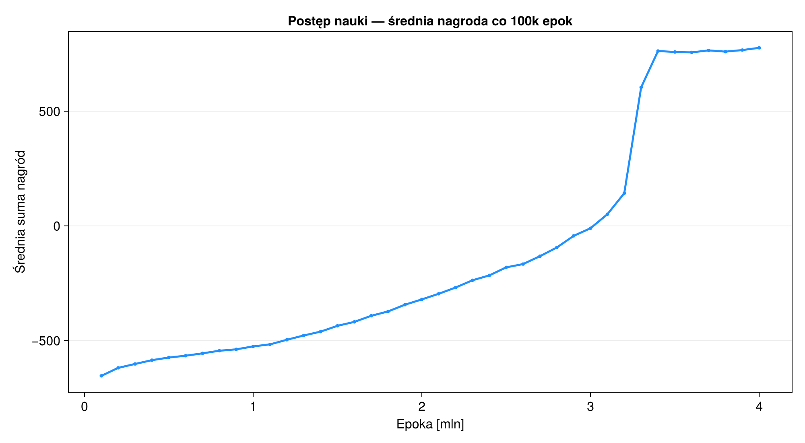
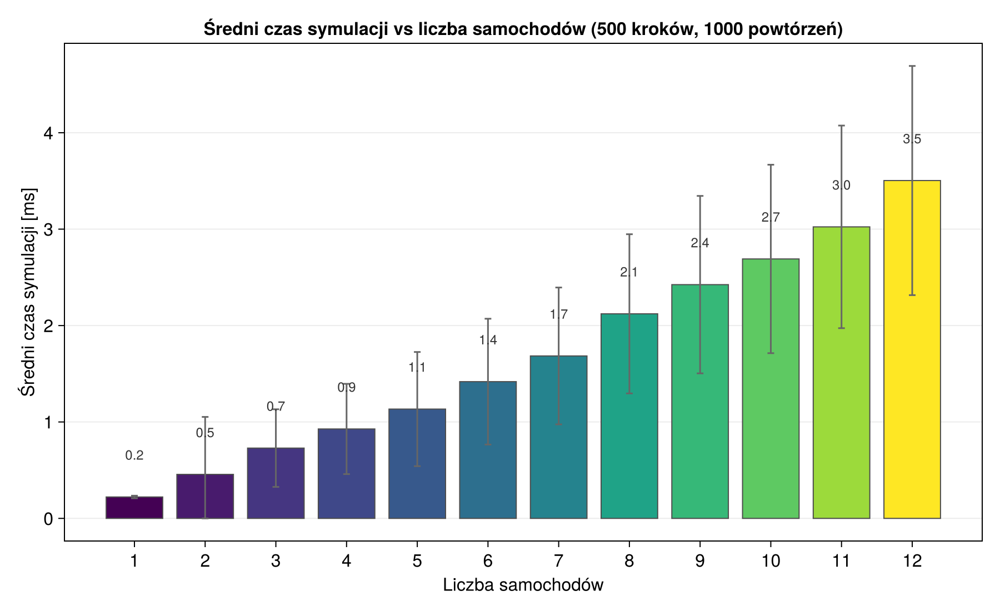
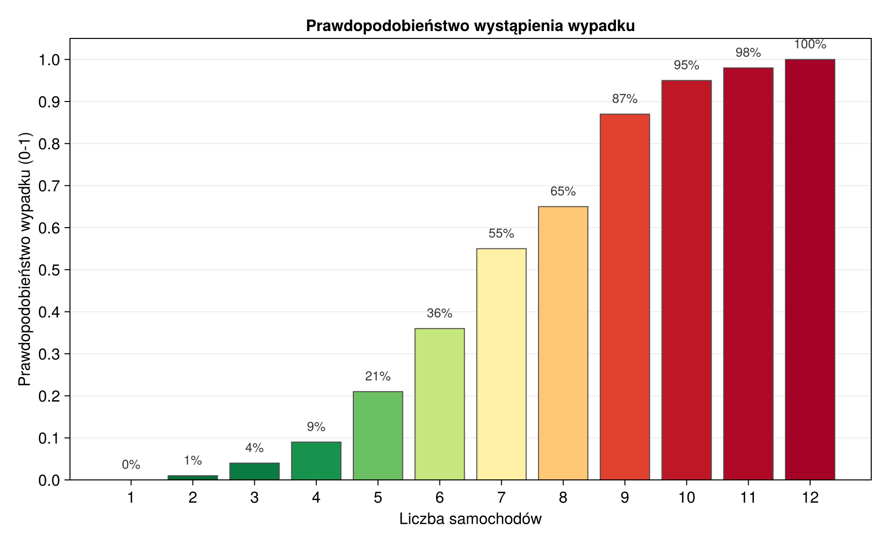
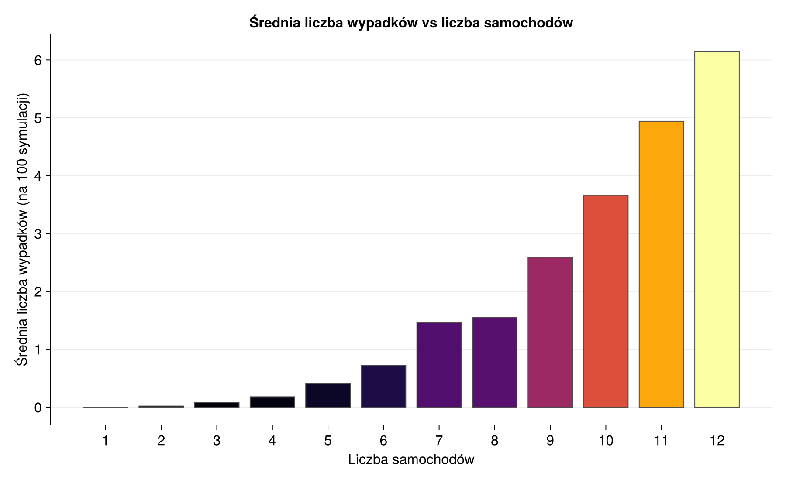

# Symulacja ruchu drogowego za pomocą uczenia ze wzmocnieniem

## Co zawiera ten projekt?

Kod jest zorganizowany w kilku katalogach, aby łatwo było się w nim odnaleźć:

- **`src/`** – Katalog zawierający główny kod symulacji:
  - `Environment.jl` – Definicja środowiska drogowego, modeli fizyki pojazdów oraz samej symulacji.
  - `RLWrapper.jl` – Kod odpowiedzialny za uczenie agentów, politykę decyzyjną (Q-learning) oraz definiowanie nagród i kar.
  - `Visualization.jl` – Skrypty rysujące symulację na ekranie (generowanie wideo i zdjęć środowiska).
- **`scripts/`** – Skrypty uruchamiające konkretne zadania:
  - `train.jl` – Służy do treningu modelu. 
  - `render_final.jl` – Skrypt generujący wideo pokazujące działanie w pełni wytrenowanego modelu.
  - `render_timelapse.jl` – Skrypt generujący wideo pokazujące proces uczenia.
  - `run_accident_analysis.jl` i `plot_accidents.jl` – Skrypty przeprowadzające symulacje i analizujące bezpieczeństwo.
  - `run_timing_analysis.jl` – Skrypt do testowania wydajności kodu.
- **`models/`** – Tutaj jest nauczony model.
  - `model_checkpoint.bson` – Najlepszy, finalny wytrenowany model.
- **`output/`** – Folder na wszystkie wygenerowane dane:
  - `data/` – Wyniki.
  - `plots/` – Wykresy podsumowujące trening i wydajność.
  - `videos/` – Wyrenderowane nagrania wideo z symulacji.

---

## Wyniki Analizy

### 1. Przebieg uczenia się agentów
Wykres pokazuje, jak średnia zdobywana nagroda rosła podczas treningu (uśredniona co 100 tys. epok).

### 2. Czas obliczeń vs liczba aut
Sprawdzono, jak liczba samochodów w symulacji wpływa na czas jej wykonywania. Każdy test przeprowadzono 1000 razy. 

### 3. Analiza Wypadków
Przetestowano ostateczny model pod kątem bezpieczeństwa, uruchamiając wiele symulacji z różną liczbą samochodów.

Poniższy wykres pokazuje prawdopodobieństwo wystąpienia wypadku (przynajmniej jednego w całej symulacji) w zależności od liczby aut na drodze.

Kolejny wykres to średnia liczba wypadków w jednej symulacji. Wiadomo, im ciaśniej, tym o wypadek niestety łatwiej.

---

## Wideo z Symulacji

Filmy znajdują się w katalogu `output/videos/`.

- **`traffic_simulation_timelapse.mp4`** – Pokazuje proces uczenia się agentów.
- **`final_model_Xcars.mp4`** – Seria wideo pokazujących w pełni wytrenowany, docelowy model dla konkretnej liczby samochodów (od 1 do 12 aut na planszy).